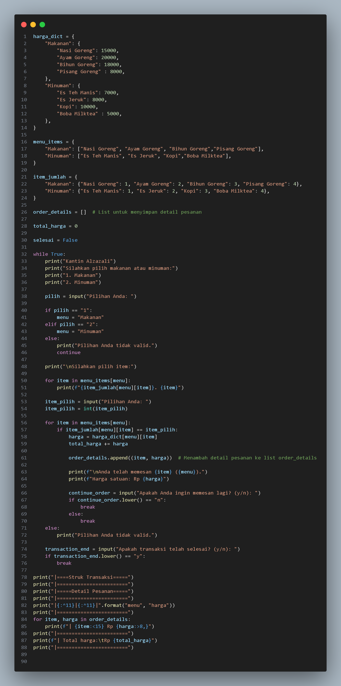
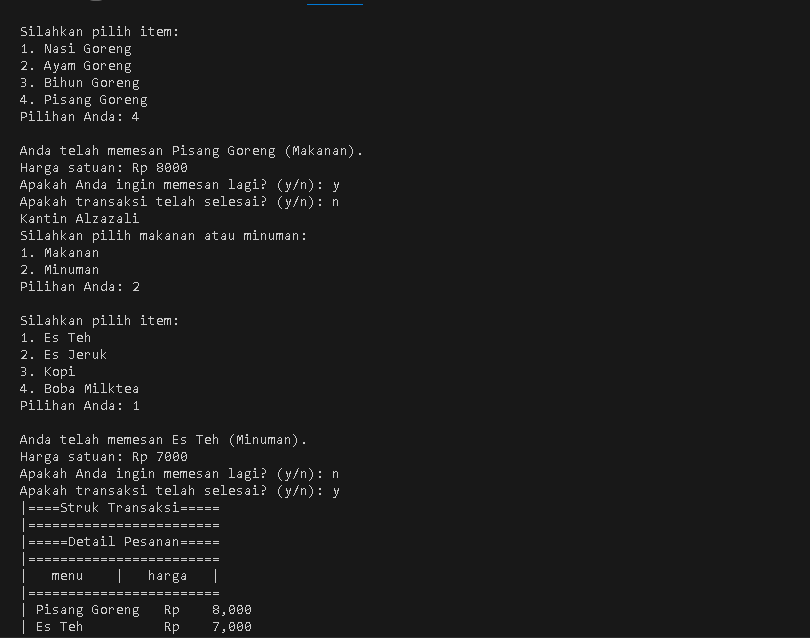

# TugasUAS
### Made By Alfian Nur Rizki
### NIM 312310665

<h1>Buatlah program kasir di sebuah kantin, dengan kondisi berikut</h1>

+ 
List opsi pilihan makanan/minuman dan aksi, bisa menggunakan format dictionary

+ 
Program harus meminta input pilihan makanan dari pengguna

+ 
Program harus menghitung total harga makanan yang dipesan

+ 
Program harus menampilkan struk pembelian 

<h1> Tampilan Program Kasir Kantin alzazali</h1>

<h1> Tampilan Output Program </h1>

## Input/Output (I/O):

+ 
input() digunakan untuk menerima input dari pengguna melalui terminal.

+ 
print() digunakan untuk mencetak output ke terminal.

## Struktur Data:

+ 
dict (dictionary) digunakan untuk menyimpan data dalam bentuk kamus dengan kunci dan nilai.

+ 
 list digunakan untuk menyimpan daftar pesanan dan detail pesanan.

## Pengulangan dan Pengkondisian:

+ 
while digunakan untuk membuat loop yang berjalan selama kondisinya benar.

+ 
if, elif, else digunakan untuk percabangan kondisi.

+ 
for digunakan untuk iterasi pada daftar menu.

## String Formatting:

+ 
format() digunakan untuk memformat string dengan menambahkan nilai ke dalam placeholder.

